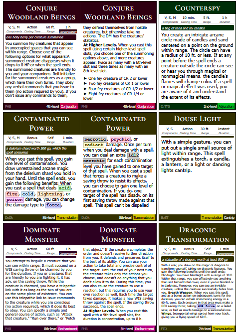
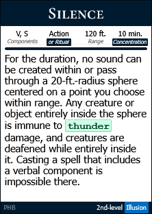
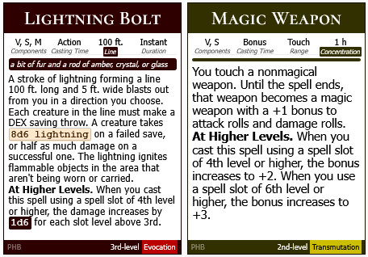

# Spellcard Generator - Complete Guide

Generates printable D&D 5e spell cards from CSV data exported from 5e.tools or other sources.
## Features

Cards sized automatically into single, double, or triple-width based on text length; Common D&D terms abbreviated (HP, AC, CR, etc.); Colorized dice rolls and damage types;



Smart attribute display - "Concentration" badge replaces "Duration" label; "or Ritual" badge replaces "Casting Time" label; Range area type (e.g., "Self Radius", "Touch Cone") badge replaces "Range" label;



## Usage

1. Download the latest `spellcard-generator_X.X.X.exe` from the [Releases section](https://github.com/thaetim/spellcard-gen/releases/latest)
2. Get Spells
	1. Go to [5e.tools Spell Table](https://2014.5e.tools/spells.html)	
	2. Select spells either by using list filters or pressing `P` on individual spells to pin them (takes precedence over filters)
	3. Open the Table View and click Export to CSV
3. Run options
	- Dragging the downloaded CSV file onto the exe
	- Placing your `Spells.csv` file in the same folder as the exe and double-clicking the `spellcard-generator_X.X.X.exe`
4. Open `out/spell_cards.html` and hit `Ctrl+P` (`Cmd+P` on Mac):
	- Layout: **Portrait
	- Margins: **None** or **Minimum**
	- Scale: **100%**
	- Background graphics: **Enabled** (to show colors)
5. Print or save as PDF

> [!TIP]+ Getting more spell sources
> Before the spell selection, do either or both:
> - Utilities / Load All Partnered Content (optional, to see all available sources)
> - Utilities / Homebrew Manager > Get Homebrew (blue button) > Select desired > Add Selected (blue ⤓ download button)

## Notes
### Sampling for Large Lists

By default, if your CSV contains more than **200 spells**, the script generates only a **sample of 69 spells** to speed up development. The sample includes:
- All spells matching specific test phrases
- Random spells to fill up to 69 total

**To generate all spells**, you'll need to edit the source code or use the executable version which doesn't have this limitation.

> [!WARNING]+
> Generating large spell lists (200+ spells) can cause the browser's font autosizing JavaScript to take several minutes to complete.

## Input Data Requirements
Your CSV file must contain spell data with these columns:

| Column           | Description        | Example                                                |
| ---------------- | ------------------ | ------------------------------------------------------ |
| **Name**         | Spell name         | `"Fireball"`                                           |
| **Level**        | Spell level        | `"3rd"` or `"3"` or `"Cantrip"`                        |
| **School**       | School of magic    | `"Evocation"`                                          |
| **Casting Time** | Time to cast       | `"Action"` or `"1 Action"`                             |
| **Range**        | Spell range        | `"150 feet"` or `"Self"`                               |
| **Components**   | V, S, M components | `"V, S, M (a tiny ball of bat guano)"`                 |
| **Duration**     | How long it lasts  | `"Instantaneous"` or `"Concentration, up to 1 minute"` |
| **Text**         | Spell description  | Full spell text with formatting                        |

**Optional columns** (will be included if present):
- `Source` - Book abbreviation (e.g., "PHB", "XGE")
- `Page` - Page number
- `Classes` - Who can cast it
- `At Higher Levels` - Upcasting effects
- `Subclasses` - Subclass-specific availability

### CSV Format Requirements

**Correct formatting:**
- Save file as UTF-8 encoding
- Use double quotes `""` around fields containing commas or newlines
- Fields with special characters must be quoted

**Example of proper CSV:**
```csv
"Name","Level","School","Casting Time","Range","Components","Duration","Text"
"Fireball","3rd","Evocation","Action","150 feet","V, S, M (a tiny ball of bat guano)","Instantaneous","A bright streak flashes from your pointing finger..."
"Cure Wounds","1st","Evocation","Action","Touch","V, S","Instantaneous","A creature you touch regains hit points..."
```

---
## Other modes
### Loop Mode (For Development/Testing)

```bash
spellcard-generator_1.0.0.exe --loop
```

**What happens:**
1. Generates cards once
2. Shows: `Press ENTER to (re)generate or ESC to exit...`
3. Press **ENTER** to regenerate (useful when editing CSV)
4. Press **ESC** to exit

### Using a Different CSV File

**Option A: Drag and Drop**
- Drag your CSV file onto the exe icon
- Output goes to `out/` folder next to the exe

**Option B: Command Line**
```bash
spellcard-generator_1.0.0.exe "path/to/your/spells.csv"
```

### For Developers (Run from Source)

If you're running from Python source code:

```bash
# Basic usage
python generate.py
# Press ENTER to regenerate, ESC to exit

# Developer mode (single run)
python generate.py --dev

# Watch mode (auto-regenerate on changes)
python runwatch.py
```

## Manual Corrections

### `data/Spells-fixed.csv`

Contains manually corrected spell data to override automatic processing. The script checks this file first for each spell. Use this to fix problematic spells with broken formatting, incorrect data, or special requirements.

---

## Troubleshooting

### Common Errors and Solutions

**"ERROR: CSV file not found"**
- Make sure `Spells.csv` is in the **same folder** as the exe
- Or drag your CSV file directly onto the exe

**"ERROR: CSV file validation failed"**

**Missing columns:**
- Ensure all required columns (Name, Level, School, etc.) are present

**Invalid Level Values:**
- Use `"Cantrip"`, `"1st"`, `"2nd"`, `"3rd"`, etc.
- Or plain numbers: `"1"`, `"2"`, `"3"`, etc.

**CSV Formatting Issues:**
- Fields containing commas or newlines MUST be enclosed in double quotes:
  ✅ `"V, S, M (bat guano)"`
  ❌ `V, S, M (bat guano)`

**Encoding Issues:**
- Save your CSV file with UTF-8 encoding
- **Excel:** Save As → CSV UTF-8 (Comma delimited)
- **Google Sheets:** File → Download → CSV

**Cards Look Wrong**
- Enable "Background graphics" in print settings
- Use Portrait orientation with minimum margins
- Try Chrome browser for best compatibility

**Antivirus Warnings** (False Positives)
- Add exception for the exe in your antivirus
- Or run from Python source code if concerned

---
## Repo File Structure

- `generate.py` - Main entry point
- `runwatch.py` - File watcher for auto-regeneration
- `card_generator.py` - Card HTML generation
- `spell_processing.py` - CSV loading, merging, sampling
- `text_formatting.py` - Text processing, splitting, abbreviations
- `spell_styling.py` - Damage type colorization
- `templates/` - HTML/CSS templates for cards
- `data/Spells-fixed.csv` - Manual spell corrections
- `data/Spells.csv` - Input data (place your CSV here)
## License

See LICENSE file.

**Note:** This tool generates spell cards for personal use. All spell data is copyright Wizards of the Coast. Use responsibly and respect intellectual property rights.